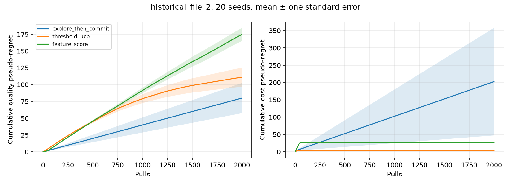

# Cost and quality tradeoffs in multi-armed bandits

A reproducible research sandbox for choosing a low-cost action while learning whether its expected reward meets a fixed quality threshold. It compares three policies on synthetic Gaussian arms and reports cost and quality separately.

The project began as Junzhe Zong's September–November 2024 student research project, advised by Prof. Osman Yağan (Carnegie Mellon University). The original implementation is preserved in [historical/](historical/README.md). The maintained package and experiments below were added with Codex assistance in September 2026; their results are new demonstrations, not recovered 2024 findings.

[Run a comparison](#run-a-comparison) · [Recorded tradeoffs](#recorded-demonstration) ·
[Tuning protocol](#optional-bayesian-tuning) · [Validation](VALIDATION.md)

The central question is the tradeoff between action cost and reward shortfall,
not which policy maximizes reward alone. In the recorded scenario-2 runs,
threshold UCB has lower mean cost pseudo-regret but higher mean quality
pseudo-regret than explore-then-commit; neither result establishes a general winner.

## Run a comparison

From the repository root, use Python 3.11 or newer. The core simulator needs only NumPy; after installation, comparisons run locally without network access.

```bash
python -m venv .venv
source .venv/bin/activate
python -m pip install -e .
python -m bandit_cost_quality compare \
  --scenario scenarios/file_2.json --horizon 2000 \
  --output results/comparison.json
python -m unittest discover -s tests -v
```

The default comparison uses seeds 0–19. Set `--seeds 3 4 5` to choose them explicitly. JSON includes complete configuration, actual pull counts, per-seed results, aggregate uncertainty, paired differences, library versions, and source SHA-256 hashes. Existing output files are not overwritten.

For plots, install `python -m pip install -e '.[plot]'` and add `--plot results/comparison.png`. A tested Python 3.12 dependency snapshot is provided in [requirements-repro.txt](requirements-repro.txt).

Extensionless plot paths receive `.png`; existing destinations, symlinks and
JSON/plot collisions (including one output nested inside the other) are rejected
before computation. See [validation notes](VALIDATION.md) for
the output-safety checks and maintenance history.

## What is being measured?

Each arm has a known cost `c_i` and unknown Gaussian reward mean `mu_i`. The quality threshold `tau` is known. The reference arm is the cheapest arm with `mu_i >= tau`; the simulator requires at least one such arm. Policies use observed rewards, costs, and the threshold. They never use the true means for action selection.

For a realized action sequence `a_1, ..., a_T`, the two finite-run quantities are:

```text
quality pseudo-regret = sum_t max(0, tau - mu[a_t])
cost pseudo-regret    = sum_t max(0, c[a_t] - c[cheapest truly feasible arm])
```

These sum expected per-arm gaps along the sampled action path. They do not subtract the noisy observed rewards. Averaging over independent seeds estimates the expected quantities. Costs and reward quality can have different units, so they are reported separately.

At each seed, policies receive the same stream for each arm: the nth pull of arm i returns the same reward under every policy. Policy exploration has a separate random generator. This pairing supports per-seed comparisons without forcing different arms to share a reward draw; it does not guarantee reduced variance in every setting.

## Policies and historical corrections

| Maintained policy | Rule after initialization | Origin |
| --- | --- | --- |
| `explore_then_commit` | Commit to the cheapest empirically feasible arm; if none, commit to the largest empirical mean. | Corrected `Algorithm1` |
| `threshold_ucb` | Choose the cheapest arm whose empirical mean plus `sqrt(2 log(max(T,2))/n_i)` meets or exceeds the threshold; if none, choose the largest upper bound. | `Algorithm3` |
| `feature_score` | Choose the largest weighted score from observed mean, cost, shortfall, overflow, count, confidence radius, and two feasibility indicators. | Corrected `Algorithm2` |

All ties use the lowest arm index. Initialization pulls arms in order up to `min(K,T)`. Every policy performs exactly `T` pulls, records every pull, and updates its empirical means throughout the run.

For extra exploration, the historical target is retained as `min(T, max(K, ceil(T**alpha)-1))`, including initialization. Defaults are `alpha=0` for explore-then-commit and `alpha=0.5` for feature score. Additional exploration can be sequential or random through the Python API and tuner. Threshold-UCB has no additional exploration phase.

The feature score uses `sqrt(4 log(t+1)/n_i)` with `t` completed pulls. Feature version 1 removes the historical `remaining_pulls` term, whose value was identical for every arm and could not change the chosen arm. The eight feature names are recorded in tuning artifacts. Default weights are untrained: minus cost plus a `max(cost)+1` bonus for optimistic feasibility. If no arm is optimistically feasible, this default chooses the cheapest arm. Tuned weights may produce different behavior.

The confidence radii retain the historical unit-scale formulas. Supplied scenarios have reward standard deviation 1. Other nonnegative standard deviations are accepted for simulation, but these radii are not automatically calibrated to them. No regret guarantee is asserted. This repository contains neither a vanilla reward-maximizing UCB benchmark nor a Thompson Sampling implementation.

## Recorded demonstration

The following results use [file_2.json](scenarios/file_2.json), `T=2000`, and seeds 0–19. Values are means ± one standard error across seeds; these are not confidence intervals.

| Policy | Quality pseudo-regret | Cost pseudo-regret |
| --- | ---: | ---: |
| Explore then commit | 79.96 ± 22.42 | 202.50 ± 155.21 |
| Threshold UCB | 110.90 ± 14.18 | 3.00 ± 0.00 |
| Feature score, untrained | 174.58 ± 9.77 | 26.50 ± 0.00 |



On these runs, threshold UCB incurred lower cost regret than explore-then-commit while its mean quality shortfall was higher. The untrained feature policy did worse on both displayed means than threshold UCB. This small synthetic experiment supports inspecting the tradeoff; it does not establish general superiority or statistical significance. A zero reported standard error means this component was identical across these sampled runs.

Full records are available for [scenario 1](examples/file_1_comparison.json), [scenario 2](examples/file_2_comparison.json), and [scenario 3](examples/file_3_comparison.json). See [VALIDATION.md](VALIDATION.md) for commands, test coverage, and provenance checks.

## Optional Bayesian tuning

```bash
python -m pip install -e '.[tuning]'
python -m bandit_cost_quality tune \
  --scenario scenarios/file_2.json --horizon 500 --trials 8 \
  --train-seeds 0 1 2 --evaluation-seeds 100 101 102 103 104 \
  --output results/tuning.json
```

The finite trial budget searches eight feature weights in `[-5,5]`, an exploration exponent, and sequential/random exploration. A Gaussian-process optimizer minimizes `(quality_weight * quality + cost_weight * cost) / T` averaged over fixed training seeds. Defaults for both weights are 1; change them with `--quality-weight` and `--cost-weight` to make the tradeoff explicit. There is no scale normalization between cost and reward units.

Evaluation seeds must be disjoint from training seeds and never enter candidate selection. The resulting JSON records every training query and a separate evaluation against the other two policies. Use `compare --tuned results/tuning.json` with the same scenario/horizon and fresh seeds to evaluate again. It rejects training-seed overlap and incompatible feature versions or configurations. Reusing the evaluation results to choose weights would consume that holdout and require another evaluation set.

The checked-in [eight-trial tuning artifact](examples/file_2_tuning_smoke.json) demonstrates the workflow with only five evaluation seeds. It is a smoke experiment, not evidence of successful optimization or a recommended policy.

## Research context and scope

[Sinha et al., *Multi-Armed Bandits with Cost Subsidy* (AISTATS 2021)](https://proceedings.mlr.press/v130/sinha21a.html) is related background. Their setting defines feasibility relative to the unknown best mean and assumes bounded rewards. This code instead uses a known fixed threshold and Gaussian rewards. The paper's algorithms and guarantees should not be attributed to this implementation.

All bundled scenarios are synthetic. There is no external dataset, trained model, publication claim, or reproduced theorem result. Historical pickle files, bytecode, tuning logs, and plots are excluded from the maintained tree. No license has been added.
